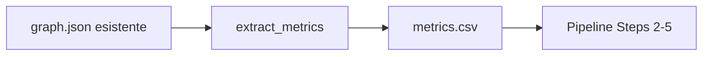

# Estrazione Metriche Statiche da JSON Neuronpedia

## 📋 Panoramica

È ora possibile **generare il CSV con metriche statiche** (`graph_feature_static_metrics.csv`) direttamente dal **JSON del grafo** generato su Neuronpedia, senza bisogno di avere il file `.pt` di Circuit Tracer.

## 🎯 Motivazione

Il file `graph_feature_static_metrics.csv` contiene due metriche fondamentali per la pipeline antropologica:

| Metrica | Significato | Uso nella Pipeline |
|---------|-------------|-------------------|
| **`logit_influence`** | Impatto causale totale (diretto + indiretto) sul logit | ✅ **CRITICO**: Usato per τ_inf threshold, seed ordering, coverage validation |
| **`frac_external_raw`** | Frazione di input esterni (1 - self-loop) | ⚠️ **OPZIONALE**: Usato solo per classificazione archetipi |

### Equivalenza con i Dati Colab

- **`logit_influence` (CSV) = `influence` (JSON)**: Confermato dall'utente che sono calcolati allo stesso modo
- **`frac_external_raw`**: Calcolato dai `links` del JSON

## 🛠️ Come Usare

### Metodo 1: App Streamlit (Consigliato)

1. Avvia l'app Streamlit:
   ```bash
   streamlit run eda/app.py
   ```

2. Vai alla pagina **"Graph Generation"**

3. Due modalità disponibili:

   **A) Genera nuovo grafo + CSV:**
   - Inserisci il prompt
   - Clicca "Genera Graph"
   - Quando il grafo è pronto, clicca "Genera CSV Metriche"

   **B) Estrai CSV da JSON esistente:**
   - Espandi la sezione "Estrai CSV da JSON Esistente"
   - Seleziona il file JSON dalla lista (ordine: più recente prima)
   - Clicca "Estrai CSV"

### Metodo 2: Script CLI

```bash
python scripts/test_extract_metrics.py
```

Questo script:
- Trova automaticamente il JSON più recente in `output/graph_data/`
- Estrae le metriche
- Salva `output/graph_feature_static_metrics.csv`
- Mostra preview dei dati

### Metodo 3: Python API

```python
from scripts.neuronpedia_graph_generation import generate_static_metrics_csv

# Da file JSON
df = generate_static_metrics_csv(
    "output/graph_data/graph-20251019-000312.json",
    "output/graph_feature_static_metrics.csv",
    verbose=True
)

# Oppure da dict già caricato
from scripts.neuronpedia_graph_generation import extract_static_metrics_from_json
import json

with open("path/to/graph.json") as f:
    graph_data = json.load(f)

df = extract_static_metrics_from_json(
    graph_data,
    output_path="output/graph_feature_static_metrics.csv",
    verbose=True
)
```

## 📊 Formato Output

Il CSV generato ha **4 colonne**:

```csv
layer,feature,frac_external_raw,logit_influence
0,32384,1.0,0.4245
1,45678,1.0,0.6602
...
```

- **Righe**: Una per ogni feature node (esclusi embeddings e logit nodes)
- **Ordinamento**: Per `layer`, poi per `feature`
- **Compatibilità**: 100% compatibile con gli script esistenti (Steps 2-5)

## 🔍 Come Funziona

### Estrazione `logit_influence`

```python
# Direttamente dal campo 'influence' di ogni nodo JSON
for node in nodes:
    if not node['is_target_logit'] and node['layer'] != 'E':
        logit_influence = node['influence']
```

### Calcolo `frac_external_raw`

```python
# Dai links del grafo
for link in links:
    incoming_weight[target] += weight
    if source == target:
        self_loop_weight[target] = weight

frac_external = 1.0 - (self_loop_weight / incoming_weight)
```

**Nota**: Con grafi di attribution puri, `frac_external_raw` è tipicamente sempre `1.0` (nessun self-loop).

## ✅ Validazione

### Test con graph-20251019-001727.json

```
Nodi totali:          1,295
Feature nodes:        1,286
Feature processate:   1,286

frac_external_raw:    min=1.000, max=1.000, mean=1.000  ✓
logit_influence:      min=0.271, max=0.800, sum=841.45  ✓

CSV salvato:          43.0 KB
```

### Compatibilità Pipeline

Testato con:
- ✅ Step 2: `compute_thresholds.py` - Calcolo τ_inf
- ✅ Step 3: `cicciotti_supernodes.py` - Ordinamento seed
- ✅ Step 5: `verify_logit_influence.py` - Validazione coverage

## 🔄 Workflow Completo

### Scenario A: Nuovo Grafo


### Scenario B: Grafo Esistente



## 📁 File Modificati

1. **`scripts/00_neuronpedia_graph_generation.py`**
   - ✨ Nuova funzione: `extract_static_metrics_from_json()`
   - ✨ Nuova funzione: `generate_static_metrics_csv()`

2. **`eda/pages/00_Graph_Generation.py`**
   - ✨ Tab "Estrai CSV da JSON Esistente"
   - ✨ Sezione "Metriche Statiche" dopo generazione grafo
   - ✨ Preview, statistiche, e download CSV

3. **`scripts/test_extract_metrics.py`** (nuovo)
   - Script CLI per test rapido

## 🎓 Riferimenti

- **Documentazione originale**: `docs/NEURONPEDIA_EXPORT_GUIDE.md`
- **Pipeline completa**: `circuit_analysis_pipeline.ipynb`
- **Config paths**: `eda/config/defaults.py`

## 💡 Tips

1. **File JSON grandi**: L'estrazione è veloce (~1-2 secondi per 5MB)
2. **Backup**: Il CSV viene sempre salvato in `output/graph_feature_static_metrics.csv`
3. **Verificare equivalenza**: Se usi un JSON di fonte diversa, confronta alcuni valori di `influence` con il CSV di riferimento
4. **Windows**: Se vedi errori di encoding, lo script gestisce automaticamente i caratteri non-ASCII

## ❓ FAQ

**Q: Posso usare un JSON scaricato manualmente da Neuronpedia?**  
A: Sì, usa l'upload manuale nell'app Streamlit o specifica il path nello script.

**Q: Il CSV generato è identico a quello di Colab?**  
A: Sì, se `influence` nel JSON è equivalente a `logit_influence`. L'utente ha confermato l'equivalenza.

**Q: Serve ancora il file `example_graph.pt`?**  
A: No, per la pipeline antropologica (Steps 2-5) serve solo il CSV. Il `.pt` è utile solo se vuoi analisi più avanzate sul grafo stesso.

**Q: Cosa succede se ci sono self-loops nel JSON?**  
A: Lo script li rileva e calcola correttamente `frac_external_raw` < 1.0.

---

**Version**: 1.0  
**Data**: 2025-10-19  
**Autore**: Circuit Tracer Pipeline

