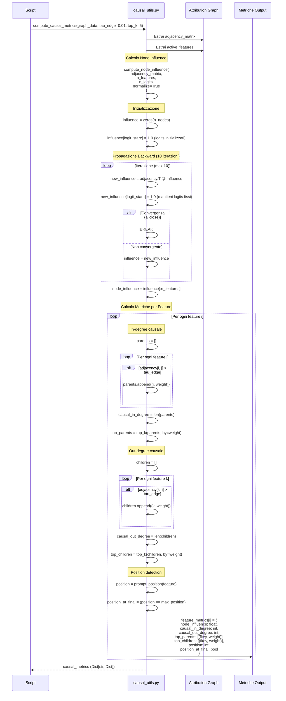
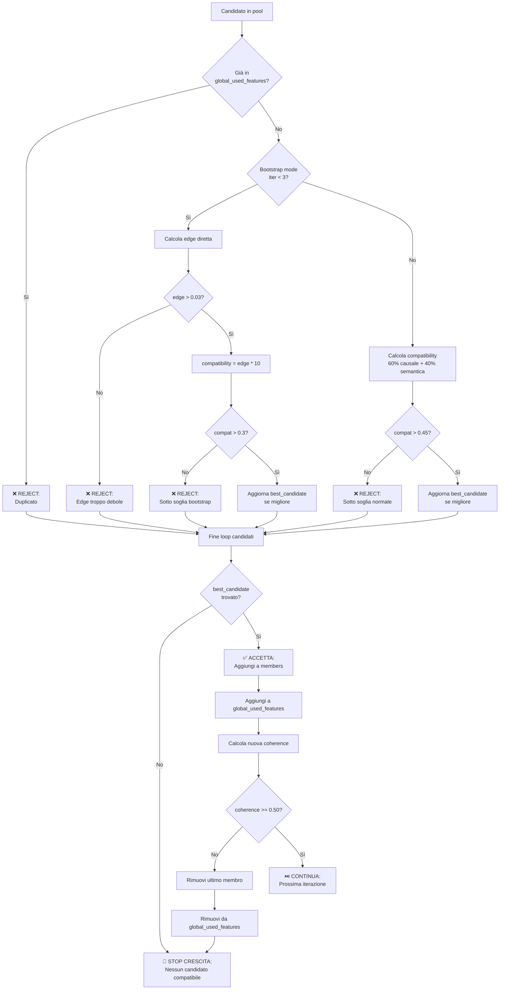

# Diagramma di Sequenza: Sistema di Labelling Supernodi

## 🔄 Flusso Completo End-to-End

```mermaid
sequenceDiagram
    participant User
    participant Pipeline as run_full_pipeline
    participant Anthro as 02_anthropological_basic.py
    participant Cicciotti as 04_cicciotti_supernodes.py
    participant Final as 05_final_optimized_clustering.py
    participant Data as Data Files
    
    User->>Pipeline: python run_full_pipeline.ps1
    
    Note over Pipeline: FASE 1: ANALISI ANTROPOLOGICA
    Pipeline->>Anthro: Esegui analisi antropologica
    
    Anthro->>Data: Carica acts_compared.csv
    Data-->>Anthro: 8192 record attivazioni
    
    Anthro->>Data: Carica graph_feature_static_metrics.csv
    Data-->>Anthro: 2048 feature con metriche statiche
    
    Anthro->>Data: Carica example_graph.pt
    Data-->>Anthro: Attribution Graph (grafo causale)
    
    Note over Anthro: Calcolo Personalità Feature
    loop Per ogni feature
        Anthro->>Anthro: Calcola mean_consistency
        Anthro->>Anthro: Calcola max_affinity
        Anthro->>Anthro: Calcola conditional_consistency
        Anthro->>Anthro: Calcola node_influence (backward propagation)
        Anthro->>Anthro: Estrai top_parents e top_children dal grafo
    end
    
    Note over Anthro: Classificazione Archetipi
    Anthro->>Anthro: Calcola soglie empiriche (percentile 75)
    loop Per ogni feature
        Anthro->>Anthro: Classifica in archetipo (Anchor/Contributor/Specialist/...)
    end
    
    Anthro->>Data: Salva feature_personalities_corrected.json
    Anthro->>Data: Salva narrative_archetypes.json
    Anthro->>Data: Salva feature_typology.json
    Anthro->>Data: Salva quality_scores.json
    
    Anthro-->>Pipeline: ✓ Analisi completata
    
    Note over Pipeline: FASE 2: COSTRUZIONE CICCIOTTI
    Pipeline->>Cicciotti: Esegui costruzione supernodi semantici
    
    Cicciotti->>Data: Carica narrative_archetypes.json
    Cicciotti->>Data: Carica feature_personalities_corrected.json
    Cicciotti->>Data: Carica example_graph.pt
    
    Note over Cicciotti: Seed Selection
    Cicciotti->>Cicciotti: Cerca "Say Austin" (edge diretta a logit)
    Cicciotti->>Cicciotti: Ordina feature per node_influence DESC
    Cicciotti->>Cicciotti: Diversifica per layer, position, token
    Cicciotti->>Cicciotti: Seleziona top 50 seed
    
    Note over Cicciotti: Crescita Supernodi
    loop Per ogni seed (max 50)
        alt Seed già utilizzato
            Cicciotti->>Cicciotti: Skip seed
        else Seed disponibile
            Note over Cicciotti: Inizializza supernodo
            Cicciotti->>Cicciotti: cicciotto = {seed, members=[seed], coherence=[1.0]}
            
            Note over Cicciotti: Crescita Iterativa
            loop Iterazione (max 20)
                Note over Cicciotti: Costruisci pool candidati
                Cicciotti->>Cicciotti: Raccogli top_parents dei membri attuali
                
                alt Bootstrap (iter < 3)
                    Cicciotti->>Cicciotti: Aggiungi anche genitori di genitori (2-hop)
                    Cicciotti->>Cicciotti: Filtra per edge > 0.03
                else Modalità Normale (iter >= 3)
                    Cicciotti->>Cicciotti: Calcola compatibility (60% causale + 40% semantica)
                end
                
                Note over Cicciotti: Selezione miglior candidato
                loop Per ogni candidato
                    alt Candidato già utilizzato globalmente
                        Cicciotti->>Cicciotti: Skip (controllo duplicati)
                    else Candidato disponibile
                        Cicciotti->>Cicciotti: Calcola compatibility score
                        Cicciotti->>Cicciotti: Aggiorna best_candidate se migliore
                    end
                end
                
                alt Best compatibility > threshold
                    Note over Cicciotti: Aggiungi candidato
                    Cicciotti->>Cicciotti: members.append(best_candidate)
                    Cicciotti->>Cicciotti: global_used_features.add(best_candidate)
                    
                    Note over Cicciotti: Calcola nuova coerenza
                    Cicciotti->>Cicciotti: coherence = compute_supernode_coherence()
                    Cicciotti->>Cicciotti: coherence_history.append(coherence)
                    
                    alt Coherence < min_threshold (0.50)
                        Note over Cicciotti: Crescita compromette coerenza
                        Cicciotti->>Cicciotti: members.pop() (rimuovi ultimo)
                        Cicciotti->>Cicciotti: global_used_features.remove(ultimo)
                        Cicciotti->>Cicciotti: BREAK (stop crescita)
                    end
                else Nessun candidato compatibile
                    Cicciotti->>Cicciotti: BREAK (stop crescita)
                end
            end
            
            alt len(members) >= 2
                Cicciotti->>Cicciotti: Accetta supernodo
            else len(members) < 2
                Cicciotti->>Cicciotti: Scarta supernodo (troppo piccolo)
                Cicciotti->>Cicciotti: Rimuovi membri da global_used_features
            end
        end
    end
    
    Note over Cicciotti: Validazione Cross-Prompt
    Cicciotti->>Data: Carica acts_compared.csv
    loop Per ogni supernodo
        loop Per ogni prompt nei dati
            Cicciotti->>Cicciotti: Conta membri attivi su questo prompt
            Cicciotti->>Cicciotti: Calcola avg consistency su questo prompt
        end
    end
    
    Cicciotti->>Data: Salva cicciotti_supernodes.json
    Cicciotti->>Data: Salva cicciotti_validation.json
    
    Cicciotti-->>Pipeline: ✓ Cicciotti completati (15 supernodi, 187 feature)
    
    Note over Pipeline: FASE 3: CLUSTERING RESIDUI
    Pipeline->>Final: Esegui clustering finale ottimizzato
    
    Final->>Data: Carica narrative_archetypes.json
    Final->>Data: Carica feature_personalities_corrected.json
    Final->>Data: Carica cicciotti_supernodes.json
    Final->>Data: Carica robust_thresholds.json
    
    Note over Final: Identificazione Residui di Qualità
    Final->>Final: Estrai feature ammesse da robust_thresholds
    Final->>Final: Calcola used_features da cicciotti_supernodes
    Final->>Final: quality_residuals = admitted - used
    
    Note over Final: Auto-Detection Token Significativi
    Final->>Final: Conta occorrenze token nei residui
    Final->>Final: Identifica structural_tokens (hardcoded + frequenti)
    Final->>Final: Identifica semantic_tokens (freq > 2% e non structural)
    Final->>Final: rare_tokens = resto
    
    Note over Final: Clustering Multi-Dimensionale
    loop Per ogni feature in quality_residuals
        Final->>Final: layer_group = f"L{(layer//3)*3}-{(layer//3)*3+2}"
        
        alt token in structural_tokens
            Final->>Final: cluster_token = token
        else token in semantic_tokens
            Final->>Final: cluster_token = token
        else token in rare_tokens
            Final->>Final: cluster_token = "RARE"
        end
        
        Final->>Final: causal_tier = HIGH/MED/LOW (basato su node_influence)
        Final->>Final: cluster_key = f"{layer_group}_{cluster_token}_{causal_tier}"
        Final->>Final: clusters[cluster_key].append(feature)
    end
    
    Note over Final: Filtro e Arricchimento
    loop Per ogni cluster
        alt len(members) >= 3
            Final->>Final: Calcola causal_connectivity (edge density)
            Final->>Final: Calcola avg_consistency
            Final->>Final: Calcola avg_node_influence
            Final->>Final: Accetta cluster
        else len(members) < 3
            Final->>Final: Scarta cluster (troppo piccolo)
        end
    end
    
    Note over Final: Post-Filtro Cicciotti
    loop Per ogni cicciotto
        alt n_members >= 3 AND final_coherence >= 0.45
            Final->>Final: Mantieni cicciotto
        else Qualità insufficiente
            Final->>Final: Rimuovi cicciotto
        end
    end
    
    Note over Final: Merge Cluster Simili
    loop Per ogni coppia di cluster computazionali
        Final->>Final: Calcola Jaccard similarity
        alt Jaccard >= 0.7
            Final->>Final: Merge cluster in uno solo
        end
    end
    
    Note over Final: Creazione Risultati Finali
    Final->>Final: Merge semantic_supernodes + computational_supernodes
    Final->>Final: Calcola comprehensive_statistics
    Final->>Final: Calcola quality_metrics
    
    Final->>Data: Salva final_anthropological_optimized.json
    
    Final-->>Pipeline: ✓ Pipeline completata
    Pipeline-->>User: ✓ Sistema di labelling completato<br/>28 supernodi, 251 feature coperte (79.6% qualità)
```

---

## 📊 Flusso Dettagliato per Singolo Supernodo

### Esempio: Crescita di CICCIOTTO_2

```mermaid
sequenceDiagram
    participant Seed as Seed 24_13277
    participant Growth as grow_cicciotto_supernode()
    participant Compat as compute_narrative_compatibility()
    participant Coh as compute_supernode_coherence()
    participant Global as global_used_features
    
    Note over Seed,Global: INIZIALIZZAZIONE
    Growth->>Global: Check if 24_13277 in global_used_features
    Global-->>Growth: False (disponibile)
    
    Growth->>Growth: cicciotto = {<br/>  seed: "24_13277",<br/>  members: ["24_13277"],<br/>  narrative_theme: "of",<br/>  coherence_history: [1.0]<br/>}
    
    Growth->>Global: Add "24_13277" to global_used_features
    
    Note over Seed,Global: ITERAZIONE 0 (Bootstrap)
    Growth->>Growth: Raccogli top_parents di 24_13277
    Growth->>Growth: Candidati: ["23_1529", "22_3064", "21_5943"]
    
    loop Per ogni candidato
        Growth->>Global: Check if candidato in global_used_features
        alt Candidato disponibile
            Growth->>Compat: Calcola edge diretta (bootstrap mode)
            Compat->>Compat: edge_weight = adjacency[seed_idx, cand_idx]
            alt edge_weight > 0.03
                Compat-->>Growth: compatibility = edge_weight * 10
            else edge_weight <= 0.03
                Compat-->>Growth: Skip candidato
            end
        else Candidato già usato
            Growth->>Growth: Skip candidato
        end
    end
    
    Growth->>Growth: Best: 23_1529 (edge=0.15, compat=1.5)
    Growth->>Growth: members.append("23_1529")
    Growth->>Global: Add "23_1529" to global_used_features
    
    Growth->>Coh: Calcola coherence
    Coh->>Coh: Raccogli consistencies = [0.72, 0.68]
    Coh->>Coh: Raccogli peak_tokens = ["of", "of"]
    Coh->>Coh: Raccogli layers = [24, 23]
    Coh->>Coh: consistency_coherence = max(0, 1 - std([0.72, 0.68]))
    Coh->>Coh: diversity_coherence = max(0, 1 - abs(1/2 - 0.5))
    Coh->>Coh: span_coherence = max(0, 1 - (24-23)/15)
    Coh->>Coh: causal_density = compute_edge_density([24_13277, 23_1529])
    Coh->>Coh: total = 0.30*consistency + 0.20*diversity + 0.20*span + 0.30*causal
    Coh-->>Growth: coherence = 0.51
    
    Growth->>Growth: coherence_history.append(0.51)
    
    alt coherence >= 0.50
        Growth->>Growth: Continua crescita
    else coherence < 0.50
        Growth->>Growth: STOP (rimuovi ultimo membro)
    end
    
    Note over Seed,Global: ITERAZIONE 1 (Bootstrap)
    Growth->>Growth: Raccogli top_parents di [24_13277, 23_1529]
    Growth->>Growth: Candidati: ["22_3064", "21_11630", ...]
    
    Note over Growth: (processo simile a iter 0)
    
    Growth->>Growth: Best: 22_3064 (edge=0.12, compat=1.2)
    Growth->>Growth: members.append("22_3064")
    Growth->>Global: Add "22_3064" to global_used_features
    Growth->>Coh: Calcola coherence
    Coh-->>Growth: coherence = 0.61
    Growth->>Growth: coherence_history.append(0.61)
    
    Note over Seed,Global: ITERAZIONE 3 (Modalità Normale)
    Growth->>Growth: Raccogli top_parents di tutti i membri
    Growth->>Growth: Candidati: ["22_11718", "19_7477", ...]
    
    loop Per ogni candidato
        Growth->>Global: Check if candidato in global_used_features
        alt Candidato disponibile
            Growth->>Compat: Calcola compatibility (causale + semantica)
            
            Note over Compat: CAUSALE (60%)
            Compat->>Compat: edge_weight = adjacency[seed_idx, cand_idx]
            Compat->>Compat: direct_edge_score = min(1.0, edge_weight / 0.05)
            
            Compat->>Compat: seed_neighbors = top_parents + top_children (seed)
            Compat->>Compat: cand_neighbors = top_parents + top_children (cand)
            Compat->>Compat: jaccard = len(seed ∩ cand) / len(seed ∪ cand)
            
            Compat->>Compat: pos_distance = abs(seed.position - cand.position)
            Compat->>Compat: position_compat = max(0, 1 - pos_distance/5)
            
            Compat->>Compat: causal = edge*0.42 + jaccard*0.33 + position*0.25
            
            Note over Compat: SEMANTICA (40%)
            Compat->>Compat: token_compat = similarity(seed.token, cand.token)
            Compat->>Compat: layer_compat = max(0, 1 - abs(seed.layer - cand.layer)/10)
            Compat->>Compat: consistency_compat = max(0, 1 - abs(seed.cons - cand.cons))
            
            Compat->>Compat: semantic = token*0.50 + layer*0.25 + consistency*0.25
            
            Compat->>Compat: total = causal*0.60 + semantic*0.40
            Compat-->>Growth: compatibility = 0.55
        end
    end
    
    Growth->>Growth: Best: 22_11718 (compat=0.55)
    
    alt compat > 0.45
        Growth->>Growth: members.append("22_11718")
        Growth->>Global: Add "22_11718" to global_used_features
        Growth->>Coh: Calcola coherence
        Coh-->>Growth: coherence = 0.62
        Growth->>Growth: coherence_history.append(0.62)
    else compat <= 0.45
        Growth->>Growth: Skip candidato
    end
    
    Note over Seed,Global: ... ITERAZIONI 4-18 ...
    
    Note over Seed,Global: ITERAZIONE 19 (Stop)
    Growth->>Growth: Raccogli top_parents di tutti i 19 membri
    Growth->>Growth: Candidati: [...]
    
    loop Per ogni candidato
        Growth->>Global: Check if candidato in global_used_features
        Growth->>Compat: Calcola compatibility
        Compat-->>Growth: compatibility < 0.45 (tutti i candidati)
    end
    
    Growth->>Growth: Nessun candidato > threshold
    Growth->>Growth: BREAK (stop crescita)
    
    Growth->>Growth: final_coherence = 0.505
    Growth->>Growth: growth_iterations = 19
    
    Growth-->>Pipeline: cicciotto = {<br/>  seed: "24_13277",<br/>  members: [20 features],<br/>  final_coherence: 0.505,<br/>  growth_iterations: 19<br/>}
```

---

## 🧮 Flusso Calcolo Metriche Causali

### compute_causal_metrics() in causal_utils.py

---

## 🔍 Decisione Flow: Accettare Candidato?

---

## 🎯 Summary: Decisioni Chiave

### **Durante Seed Selection**
1. ✅ Feature ha `node_influence` alta?
2. ✅ Feature diversifica layer/position/token?
3. ✅ Feature non già utilizzata?

### **Durante Crescita Bootstrap (iter 0-2)**
1. ✅ Candidato ha edge diretta > 0.03 verso seed?
2. ✅ Candidato non già utilizzato globalmente?
3. ✅ Compatibility > 0.3?

### **Durante Crescita Normale (iter 3+)**
1. ✅ Candidato è parent causale di almeno un membro?
2. ✅ Candidato non già utilizzato globalmente?
3. ✅ Compatibility (60% causale + 40% semantica) > 0.45?
4. ✅ Nuova coherence >= 0.50?

### **Accettazione Finale Supernodo**
1. ✅ `len(members) >= 2`?
2. ✅ `final_coherence >= 0.45`? (post-filtro)

### **Clustering Residui**
1. ✅ Feature ammessa da `robust_thresholds`?
2. ✅ Feature non già in cicciotti?
3. ✅ Cluster ha `>= 3 membri`?
4. ✅ Jaccard < 0.7 con altri cluster? (no merge)

