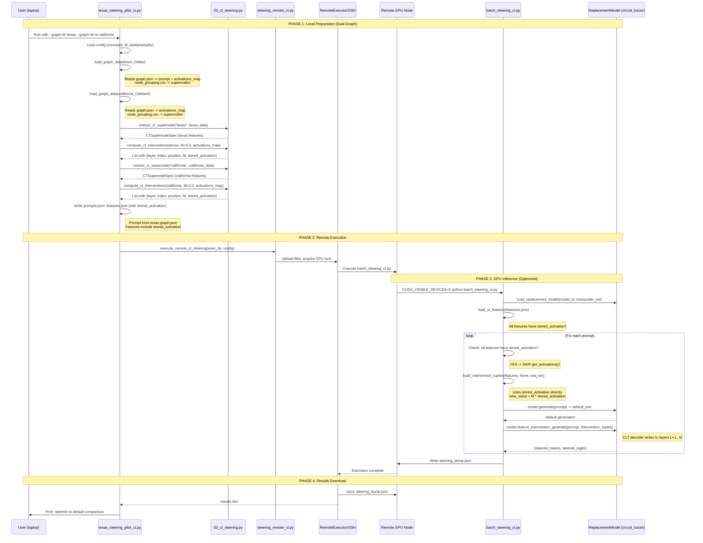

## Supernode Swap Pilots

This directory contains pilot scripts for validating supernode-level interventions
using **Circuit Tracer's ReplacementModel** before scaling to full experiments.

### Files

- `texas_steering_pilot_ct.py`
  - Runs **CT feature interventions** using Circuit Tracer's
    `ReplacementModel.feature_intervention_generate()`.
  - **Dual-graph support**: Ablate concept from one graph, amplify concept from another graph.
  - **Stored activations**: Uses activations from `graph.json` (no redundant forward pass).
  - Supports both local execution (with GPU) and remote execution via ELEUTHERAI_NODE.

---

## Quick Start: Texas -> California Swap

```bash
# Ablate "texas" features, amplify "california" features
python scripts/experiments/supernode_swap/pilots/texas_steering_pilot_ct.py \
    --remote \
    --graph-dir output/usa_states_batch/texas_Dallas \
    --graph-dir-to output/usa_states_batch/california_Oakland \
    --concept-from texas \
    --concept-to california \
    --M-ablate 0.0 \
    --M-amplify 2.0
```

This will:
1. Load Texas graph -> extract "texas" supernode features -> ablate (M=0)
2. Load California graph -> extract "california" supernode features -> amplify (M=2)
3. Use prompt from Texas graph: `"<bos>The capital of the state containing Dallas is"`
4. Run steering on remote GPU

---

## Circuit Tracer Steering Overview

Circuit Tracer steering differs fundamentally from SAE-based steering:

| Aspect | SAE-based Steering | Circuit Tracer |
|--------|-------------------|----------------|
| Model | HookedTransformer + SAE | ReplacementModel + CLT |
| Intervention | Add steering vector to single hook point | Modify feature activation, decoder writes to ALL subsequent layers |
| Position | Global (all tokens) | Position-specific |
| Method | `activations += coeff * steering_vector` | `feature_intervention_generate(intervention_tuples)` |
| Cross-layer | No | Yes (CLT decoder writes to layers L+1...N) |

### Cross-Layer Transcoder (CLT)

The CLT encodes features at one layer and decodes to ALL subsequent layers:

```
Layer L feature f activates -> CLT decoder writes to:
  - Layer L+1 residual stream
  - Layer L+2 residual stream
  - ...
  - Layer N residual stream
```

This means modifying a single feature can affect many downstream layers simultaneously.

---

## Input Data Requirements

### Required Files Structure

```
graph_dir/
  |-- 00 Graph Generation/
  |     |-- graph.json              # Graph with prompt + stored activations
  |     |-- graph_feature_static_metrics.csv  # Feature influence scores
  |
  |-- 02 Node Grouping/
        |-- node_grouping.csv       # Feature -> supernode mapping
```

### Dual-Graph Support

For concept swapping (e.g., Texas -> California), you need TWO graphs:

```
--graph-dir output/usa_states_batch/texas_Dallas      # Source: ablate "texas"
--graph-dir-to output/usa_states_batch/california_Oakland  # Target: amplify "california"
```

### 1. `graph.json` (Primary Data Source)

The **prompt** and **stored activations** come from `graph.json`:

```json
{
  "metadata": {
    "prompt": "<bos>The capital of the state containing Dallas is",
    "info": {
      "model_id": "google/gemma-2-2b",
      "transcoder_set": "mntss/clt-gemma-2-2b-2.5M"
    }
  },
  "nodes": [
    {
      "node_id": "0_1861_7",
      "activation": 1.8438
    }
  ]
}
```

**Parsing `node_id`**: `"0_1861_7"` -> layer=0, feature=1861, position=7

This eliminates the need for `get_activations()` at steering time!

### 2. `node_grouping.csv`

Maps features to conceptual supernodes:

| seed_slug | feature_id | layer | position | supernode_id | supernode_label |
|-----------|------------|-------|----------|--------------|-----------------|
| texas_Dallas | 0_12345 | 0 | 5 | 1 | texas |
| texas_Dallas | 7_67890 | 7 | 5 | 1 | texas |

### 3. `graph_feature_static_metrics.csv`

Contains influence scores per feature:

| seed_slug | feature_id | layer | static_influence |
|-----------|------------|-------|------------------|
| texas_Dallas | 0_12345 | 0 | 0.0432 |
| texas_Dallas | 7_67890 | 7 | 0.1256 |

### 4. `graph.json` (metadata)

```json
{
  "metadata": {
    "info": {
      "model_id": "google/gemma-2-2b",
      "transcoder_set": "mntss/clt-gemma-2-2b-2.5M",
      "source_urls": [...]
    }
  }
}
```

---

## Output: `features.json` (CT Intervention Format)

The pilot prepares interventions in Circuit Tracer format, following the original demo:

```json
[
  {
    "layer": 0,
    "index": 1861,
    "position": 7,
    "M": 0.0,
    "steer_generated_tokens": true,
    "stored_activation": 1.8438
  },
  {
    "layer": 7,
    "index": 86167,
    "position": 7,
    "M": 2.0,
    "steer_generated_tokens": true,
    "stored_activation": 17.17
  }
]
```

| Field | Type | Description |
|-------|------|-------------|
| `layer` | int | CLT encoder layer (0 to N-1) |
| `index` | int | Feature index in transcoder (0 to d_transcoder-1) |
| `position` | int | Token position (from graph.json node_id) |
| `M` | float | Multiplicative factor: `new_value = M * activation` |
| `steer_generated_tokens` | bool | If true, apply to all generated tokens |
| `stored_activation` | float | **NEW**: Pre-computed activation from graph.json |

**M values** (following original demo):
- `M=0`: Full ablation (set to 0)
- `M=1`: No change
- `M=2`: Double the activation
- `M=10`: 10x amplification (like in the demo)
- `M=-1`: Negate the activation (reverse direction)
- `M=-2`: Double and reverse

---

## Output: `steering_dump.json`

Results after steering:

```json
{
  "model": "google/gemma-2-2b",
  "transcoder_set": "mntss/clt-gemma-2-2b-2.5M",
  "n_prompts": 1,
  "results": [
    {
      "probe_id": "test_0",
      "prompt": "The capital of the state containing Dallas is",
      "steered": "The capital of the state containing Dallas is Tallahassee...",
      "default": "The capital of the state containing Dallas is Austin...",
      "steered_topk": [{"token": " Tall", "prob": 0.85}, ...],
      "default_topk": [{"token": " Austin", "prob": 0.92}, ...],
      "intervention_count": 15
    }
  ],
  "config": {
    "temperature": 0.3,
    "n_tokens": 32,
    "freeze_attention": false
  }
}
```

---

## Sequence Diagram: CT Steering Flow (Dual-Graph + Stored Activations)



---

## Key Code Flow in `batch_steering_ct.py`

### 1. Build Intervention Tuples (with Stored Activations)

```python
def build_intervention_tuples(features, activations, sequence_length):
    """
    If stored_activation is available, use it directly (no get_activations needed).
    Otherwise, fall back to live activations tensor.
    """
    intervention_tuples = []
    for feat in features:
        token_pos = sequence_length + feat.position if feat.position < 0 else feat.position
        
        # Prefer stored_activation from graph.json (OPTIMIZATION)
        if feat.stored_activation is not None:
            original_value = feat.stored_activation  # From graph.json
        elif activations is not None:
            original_value = activations[feat.layer, token_pos, feat.index]  # Live
        else:
            original_value = 0.0
        
        # Compute new value: new_value = M * activation
        new_value = feat.M * original_value
        
        # Position for steering (slice for generated tokens)
        if feat.steer_generated_tokens:
            steer_pos = slice(sequence_length, None)  # All generated tokens
        else:
            steer_pos = token_pos
        
        intervention_tuples.append((feat.layer, steer_pos, feat.index, new_value))
    
    return intervention_tuples
```

### 2. Skip get_activations() When Possible

```python
def run_ct_generation(prompt, features, model, ...):
    # Check if all features have stored_activation
    if all(f.stored_activation is not None for f in features):
        activations = None  # SKIP get_activations() - saves a forward pass!
        print("[OPTIMIZATION] Using stored activations from graph.json")
    else:
        _, activations = model.get_activations(prompt, sparse=True)
    
    intervention_tuples = build_intervention_tuples(features, activations, seq_len)
    ...
```

### 2. Feature Intervention Generate (circuit_tracer)

Inside `ReplacementModel.feature_intervention_generate()`:

```python
# Simplified from circuit_tracer/replacement_model.py
def _get_feature_intervention_hooks(intervention_tuples):
    # For each layer, accumulate deltas
    layer_deltas = torch.zeros(n_layers, seq_len, d_model)
    
    for (layer, pos, feat_idx, new_value) in intervention_tuples:
        # Get CLT decoder vectors (writes to ALL subsequent layers)
        decoder_vectors = clt.W_dec[layer][feat_idx]  # shape: [n_remaining_layers, d_model]
        
        # Scale by intervention value
        decoder_vectors = decoder_vectors * new_value
        
        # Add to all downstream layers
        layer_deltas[layer+1:, pos] += decoder_vectors
    
    # Return hooks that add these deltas during forward pass
```

---

## Usage

### 1. Simple Ablation (Single Graph)

Ablate "texas" features only:

```bash
python scripts/experiments/supernode_swap/pilots/texas_steering_pilot_ct.py \
    --remote \
    --graph-dir output/usa_states_batch/texas_Dallas \
    --concept-from texas \
    --M-ablate 0.0
```

### 2. Concept Swap (Dual Graph) - Texas -> California

Ablate "texas" from Texas graph, amplify "california" from California graph:

```bash
python scripts/experiments/supernode_swap/pilots/texas_steering_pilot_ct.py \
    --remote \
    --graph-dir output/usa_states_batch/texas_Dallas \
    --graph-dir-to output/usa_states_batch/california_Oakland \
    --concept-from texas \
    --concept-to california \
    --M-ablate 0.0 \
    --M-amplify 2.0
```

**Expected behavior:**
- Prompt: `"<bos>The capital of the state containing Dallas is"` (from Texas graph)
- Default output: `"Austin"` (Texas capital)
- Steered output: `"Sacramento"` (California capital) or disrupted

### 3. Negative M (Reverse Direction)

```bash
python scripts/experiments/supernode_swap/pilots/texas_steering_pilot_ct.py \
    --remote \
    --graph-dir output/usa_states_batch/texas_Dallas \
    --concept-from texas \
    --M-ablate -2.0  # Reverse and double
```

### 4. Local Execution (requires GPU + circuit_tracer)

```bash
python scripts/experiments/supernode_swap/pilots/texas_steering_pilot_ct.py \
    --local \
    --graph-dir output/usa_states_batch/texas_Dallas \
    --concept-from texas \
    --M-ablate 0.0
```

### 5. Dry Run (prepare files only)

```bash
python scripts/experiments/supernode_swap/pilots/texas_steering_pilot_ct.py \
    --dry-run \
    --graph-dir output/usa_states_batch/texas_Dallas \
    --graph-dir-to output/usa_states_batch/california_Oakland \
    --concept-from texas \
    --concept-to california
```

---

## Remote Node Setup (ELEUTHERAI_NODE)

Before running remote steering, ensure the node has:

1. **Python environment** with circuit_tracer:
   ```bash
   source /path/to/env.sh
   pip install circuit_tracer
   ```

2. **HuggingFace token** for gated models (gemma-2):
   ```bash
   export HF_TOKEN=hf_...
   ```

3. **Repository cloned** at expected path:
   ```bash
   git clone https://github.com/your-org/circuit_tracer-prompt_rover.git
   ```

4. **env.sh** with correct paths:
   ```bash
   export HF_TOKEN=hf_...
   export PYTHONPATH=/path/to/circuit_tracer-prompt_rover/scripts:$PYTHONPATH
   ```

---

## Intervention Math

Following the original circuit_tracer demo, for a feature `f` at layer `L`:

```python
# Original demo approach (now implemented)
new_value = M * activations[layer, pos, feature_idx]
```

**Ablation (M=0):**
```
new_value = 0 * a_orig = 0.0
effect = -a_orig * decoder_vectors[f]  # Removes feature contribution
```

**No Change (M=1):**
```
new_value = 1 * a_orig = a_orig
effect = 0  # No change
```

**Amplification (M=2):**
```
new_value = 2 * a_orig
effect = +a_orig * decoder_vectors[f]  # Doubles feature contribution
```

**10x Amplification (M=10, like demo):**
```
new_value = 10 * a_orig
effect = +9 * a_orig * decoder_vectors[f]  # Strong amplification
```

The decoder vectors are applied to ALL layers from L+1 to N, making this a cross-layer intervention.
