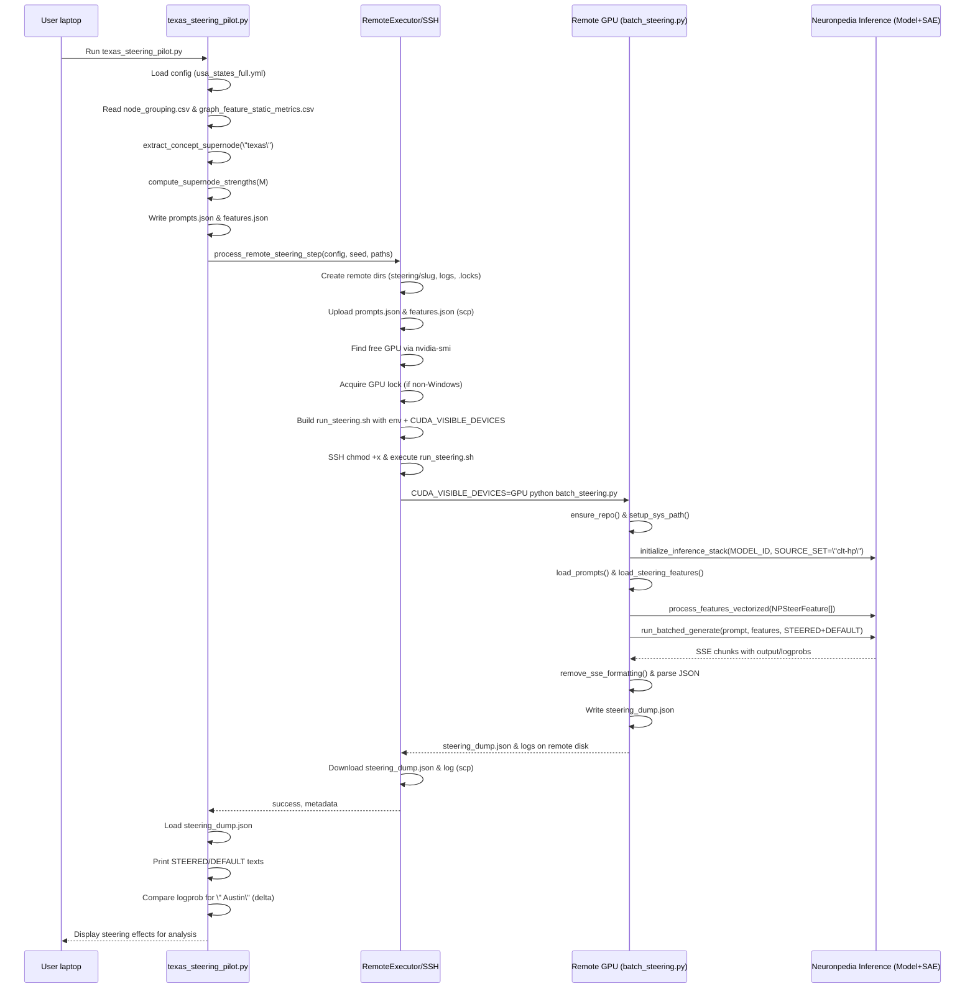

## Supernode Swap Pilots

This directory contains small, focused pilot scripts used to validate and
debug supernode-level interventions before scaling to full experiments.

### Files

- `texas_ablation_pilot.py`  
  - Runs **per-supernode ablations** for the Texas seed
    (`texas_Dallas` / Austin) using the public Neuronpedia `/steer` API
    (for SAE sets that are API-available).  
  - For a single prompt (`"The capital of the state containing Dallas is"`),
    it:
    - Loads `node_grouping.csv` and `graph_feature_static_metrics.csv`.  
    - Extracts multiple supernodes (including `"texas"`) from grouping.  
    - Computes static influence scores per supernode.  
    - Sweeps over a set of multiplicative factors `M` and measures how much
      the logprob of the Austin token changes for each ablation.

- `texas_steering_pilot.py`  
  - Runs **full steering with `clt-hp`**, using the Neuronpedia inference
    code on a remote GPU node (no public API).  
  - For the same Texas prompt, it:
    - Extracts the `"texas"` supernode locally via `03_neuronpedia_steering.py`.  
    - Converts its features into per-feature steering strengths.  
    - Writes `prompts.json` and `features.json` under
      `output/steering_pilots/texas/`.  
    - Uses the remote steering helper to call
      `scripts/neuronpedia_steering/batch_steering.py` on the GPU node
      (which internally runs `run_batched_generate` with `clt-hp`).  
    - Downloads `steering_dump.json` and prints the STEERED/DEFAULT texts
      and the logprob delta for the Austin token.

### High-Level Sequence (Texas Steering Pilot)

The steering pilot uses the following flow:

1. **Local laptop**
   - You run:
     - `python scripts/experiments/supernode_swap/pilots/texas_steering_pilot.py`
   - The pilot:
     - Reads `usa_states_full.yml` to get model/source set and remote config.  
     - Reads Texas `node_grouping.csv` and `graph_feature_static_metrics.csv`.  
     - Uses `extract_concept_supernode("texas")` to get the Texas supernode.  
     - Uses `compute_supernode_strengths` to produce feature strengths.  
     - Writes:
       - `prompts.json` with the Dallas prompt.  
       - `features.json` describing steering features.

2. **Remote steering orchestration**
   - The pilot calls
     `experiments.batch.pipeline.steering_remote.process_remote_steering_step`.  
   - `RemoteExecutor.run_remote_steering`:
     - Creates a remote experiment directory (e.g. `$BASE/steering/texas_Dallas`).  
     - Uploads `prompts.json` and `features.json` via `scp`.  
     - Finds a free GPU (`nvidia-smi`), acquires a lock, and builds a tiny
       shell script to run steering.  
     - The script activates the remote environment, sets env variables
       (`MODEL_ID`, `SOURCE_SET=clt-hp`, `PROMPTS_JSON_PATH`, etc.), and then
       runs:
       - `python scripts/neuronpedia_steering/batch_steering.py 2>&1 | tee ...`

3. **Remote GPU node (`batch_steering.py`)**
   - `batch_steering.py`:
     - Clones (or reuses) the Neuronpedia repo under `NP_WORKDIR`.  
     - Adds `apps/inference` and `neuronpedia-inference-client` to `sys.path`.  
     - Initializes `Config`, `Model`, and `SAEManager` for `MODEL_ID` +
       `SOURCE_SET="clt-hp"`.  
     - Loads prompts via `load_prompts(prompts.json)`.  
     - Loads steering features (`source`, `index`, `strength`) and converts
       them into `NPSteerFeature` objects.  
     - Calls `process_features_vectorized` to compute steering vectors
       from the CLT decoder (`W_dec`).  
     - For each prompt, calls `run_batched_generate` with:
       - `STEERED` and `DEFAULT` types,  
       - `NPSteerMethod` (e.g. `ORTHOGONAL_DECOMP`),  
       - `strength_multiplier`, `seed`, `temperature`, `freq_penalty`, etc.  
     - Parses the SSE-style generator output into a
       `steering_dump.json` containing STEERED/DEFAULT texts and logprobs.

4. **Back to local laptop**
   - `RemoteExecutor.run_remote_steering`:
     - Downloads `steering_dump.json` and the remote log file to the local
       `outputs_dir`.  
   - `texas_steering_pilot.py`:
     - Loads `steering_dump.json`, prints the prompt and the STEERED/DEFAULT
       continuations.  
     - Looks up the logprob of the Austin token in both STEERED and DEFAULT
       logprobs and prints the delta.

This setup lets you validate CLT-based steering end-to-end on a single
case (Texas/Dallas/Austin) using the exact Neuronpedia inference code,
before scaling up to 50×50 state-swap experiments.

### Sequence Diagram (Texas Steering Pilot)

